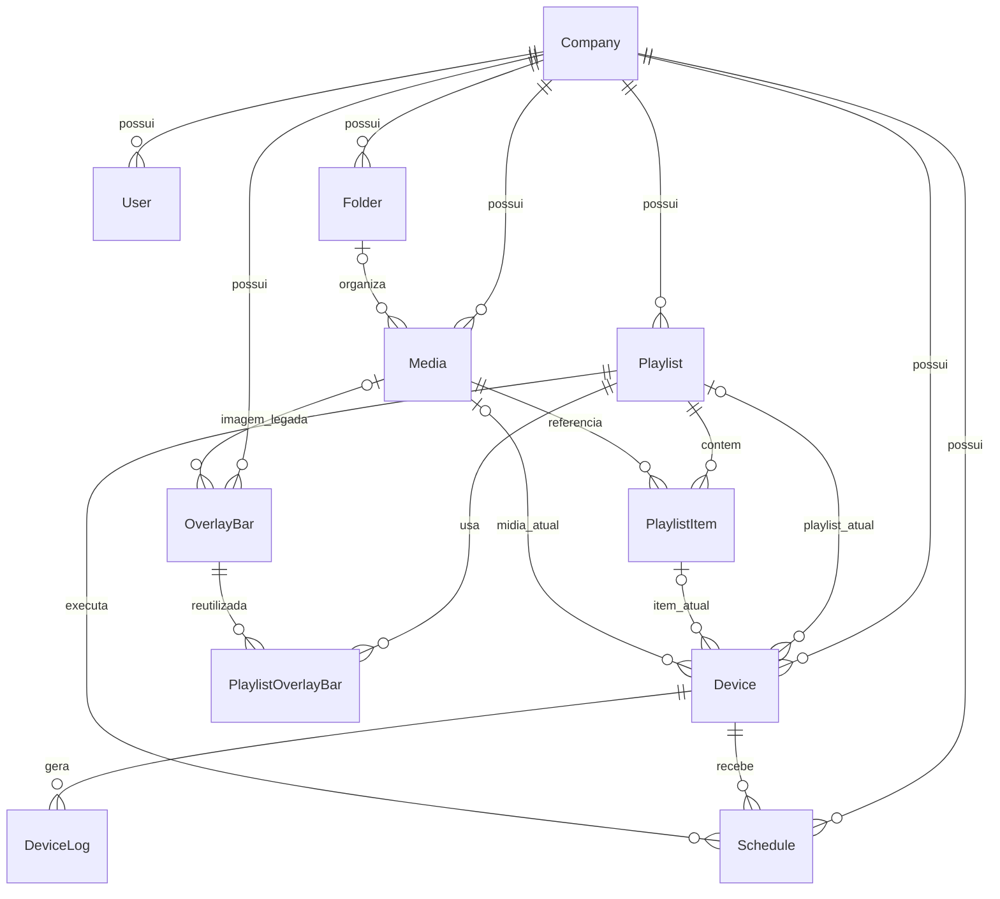

# Modelo de dados

## Diagrama



## Entidades

### Company

Raiz do isolamento multiempresa. Possui nome, slug único e relações com todos os recursos administrativos.

### User

Usuário do painel. O e-mail é globalmente único; a senha contém hash bcrypt. O perfil é `OWNER`, `ADMIN` ou `OPERATOR`.

### Device

Representa uma instalação do Player. Armazena código, vínculo, empresa, último heartbeat, credenciais em hash e o estado de reprodução mais recente. O status persistido é atualizado pelo heartbeat, mas as respostas recalculam online/offline usando o limite de 60 segundos.

### DeviceLog

Histórico associado ao Player. A mensagem pode ser texto legado ou payload serializado com prefixos de origem administrativa, sistema ou Player. Exclusão do dispositivo remove os logs em cascata.

### Media

Metadados de imagem ou vídeo. `fileUrl` aponta para o arquivo físico; `duration` e `hasAudio` são extraídos de vídeos quando possível. A mídia pertence a uma empresa e opcionalmente a uma pasta.

### Playlist e PlaylistItem

Playlist define nome e orientação. `PlaylistItem` relaciona mídia, ordem, duração e estado de áudio. A combinação playlist/ordem é única. Exclusão da playlist remove itens em cascata.

### OverlayBar e PlaylistOverlayBar

`OverlayBar` guarda aparência e blocos em JSON. A tabela associativa permite reutilizar uma barra em várias playlists e mantém a ordem das barras por playlist.

### Schedule

Associa uma playlist a um dispositivo, com intervalo de datas, horário, dias da semana, prioridade e estado. Exclusão do dispositivo ou playlist remove o agendamento em cascata.

### Folder

Organiza mídias da empresa. A mídia pode existir sem pasta.

## Índices e integridade relevantes

- `Company.slug`, `User.email`, `Device.code` e `Device.deviceTokenHash` são únicos.
- `PlaylistItem(playlistId, order)` impede duas mídias na mesma posição.
- `PlaylistOverlayBar(playlistId, overlayBarId)` impede vínculo duplicado.
- `PlaylistOverlayBar(playlistId, order)` mantém ordem única.
- índices de empresa aceleram o isolamento das consultas.
- índices de heartbeat e reprodução apoiam o painel de dispositivos.
- relações de conteúdo usam cascade ou set-null conforme a necessidade de preservar o dispositivo.

## Migrations

O schema é evoluído por arquivos em `prisma/migrations`. Em produção:

```sh
npm run prisma:generate
npm run prisma:migrate:deploy
```

Não use `prisma migrate dev` em produção. Toda migration deve ser revisada quanto a lock, perda de dados, tempo de execução e compatibilidade com a versão anterior da API.

## Backup consistente

O banco contém apenas metadados das mídias. Para uma restauração completa, o dump MySQL e o diretório `MEDIA_STORAGE_PATH` devem pertencer ao mesmo ponto lógico no tempo. Após restaurar, valide se cada `Media.fileUrl` possui arquivo correspondente.
